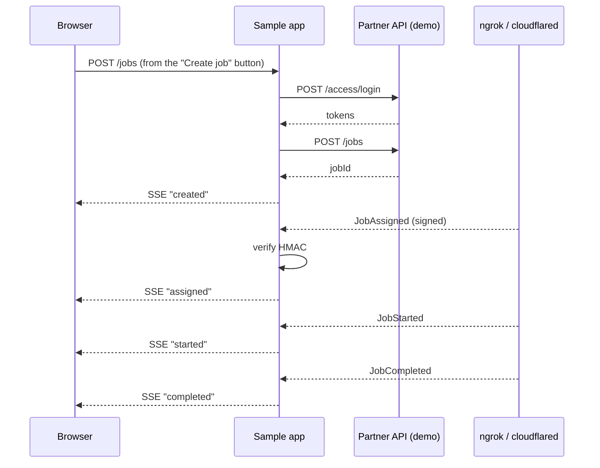

# CodeSandbox Test App

A small Node.js + Express project that exercises the Partner API
end-to-end: it logs in, creates a job on the demo environment,
receives signed callbacks, verifies the HMAC, and shows the state
transitions live in a browser tab. Drop these files into a CodeSandbox
Node template and you're running in about five minutes.

## What you'll have working



A single-page UI streams every event as it arrives. Signature failures
show up in red.

## Why CodeSandbox

- Gives you a public HTTPS URL out of the box — no tunnelling needed
  if you pick the "Node" template.
- `.env` support for keeping your credentials out of the code.
- Fork-and-share — show a teammate a working round-trip by sending
  them a URL.

## Stack

| Piece | Choice |
|---|---|
| Runtime | Node 20 |
| HTTP server | Express 4 |
| Live browser push | Server-Sent Events (no websocket library needed) |
| HTTP client | Built-in `fetch` |
| Config | `dotenv` |

No build step, no bundler, no frontend framework — the whole project
is about 150 lines.

## File layout

```
.
├─ package.json
├─ .env.example
├─ server.js
└─ public/
   └─ index.html
```

## `package.json`

```json
{
  "name": "g2sentry-partner-sandbox",
  "version": "1.0.0",
  "type": "module",
  "scripts": { "start": "node server.js" },
  "dependencies": {
    "dotenv": "^16.4.5",
    "express": "^4.19.2"
  }
}
```

## `.env.example`

Copy to `.env` on CodeSandbox and fill in your demo credentials from
the portal.

```
PORT=3000
G2SENTRY_BASE=https://partner-api-demo.g2sentry.com/api/v1
G2SENTRY_PARTNER_KEY=acme-corp
G2SENTRY_PARTNER_SECRET=replace-me
G2SENTRY_CALLBACK_SECRET=replace-me
```

## `server.js`

```js
import 'dotenv/config';
import express from 'express';
import crypto from 'node:crypto';

const {
  PORT = 3000,
  G2SENTRY_BASE,
  G2SENTRY_PARTNER_KEY,
  G2SENTRY_PARTNER_SECRET,
  G2SENTRY_CALLBACK_SECRET,
} = process.env;

const app = express();

// ---- token cache -------------------------------------------------
let accessToken = null;
let accessTokenExpiresAt = 0;

async function getToken() {
  if (accessToken && Date.now() < accessTokenExpiresAt) return accessToken;
  const res = await fetch(`${G2SENTRY_BASE}/access/login`, {
    method: 'POST',
    headers: { 'Content-Type': 'application/json' },
    body: JSON.stringify({
      partnerKey: G2SENTRY_PARTNER_KEY,
      partnerSecret: G2SENTRY_PARTNER_SECRET,
    }),
  });
  if (!res.ok) throw new Error(`login ${res.status}`);
  const data = await res.json();
  accessToken = data.accessToken;
  accessTokenExpiresAt = Date.now() + 14 * 60_000; // 1 min headroom
  return accessToken;
}

// ---- SSE channel to the browser ---------------------------------
const subscribers = new Set();
function broadcast(event) {
  const line = `data: ${JSON.stringify(event)}\n\n`;
  for (const res of subscribers) res.write(line);
}

app.get('/events', (req, res) => {
  res.set({
    'Content-Type': 'text/event-stream',
    'Cache-Control': 'no-cache',
    Connection: 'keep-alive',
  });
  res.flushHeaders();
  subscribers.add(res);
  req.on('close', () => subscribers.delete(res));
});

// ---- create a demo job ------------------------------------------
app.use('/jobs', express.json());
app.post('/jobs', async (_req, res) => {
  const token = await getToken();
  const in3h = new Date(Date.now() + 3 * 60 * 60 * 1000).toISOString();
  const body = {
    name: 'CodeSandbox smoke test',
    whenDate: in3h,
    duration: 60,
    location: {
      address: {
        address1: '123 Main St',
        city: 'New York',
        state: 'NY',
        zip: '10001',
      },
    },
    client: {
      clientId: 'sandbox-demo',
      clientPhone: '+15551234567',
    },
  };
  const r = await fetch(`${G2SENTRY_BASE}/jobs`, {
    method: 'POST',
    headers: {
      'Content-Type': 'application/json',
      Authorization: `Bearer ${token}`,
    },
    body: JSON.stringify(body),
  });
  const job = await r.json();
  broadcast({ phase: 'created', job });
  res.json(job);
});

// ---- callback receiver ------------------------------------------
// IMPORTANT: raw body before any JSON middleware — HMAC is over the
// bytes we received, not over a re-serialised parse.
app.use(
  '/callbacks/g2sentry',
  express.raw({ type: 'application/json' }),
);

app.post('/callbacks/g2sentry', (req, res) => {
  const provided = req.header('X-Signature') || '';
  const expected = crypto
    .createHmac('sha256', G2SENTRY_CALLBACK_SECRET)
    .update(req.body)
    .digest('hex');

  const ok =
    provided.length === expected.length &&
    crypto.timingSafeEqual(
      Buffer.from(provided, 'hex'),
      Buffer.from(expected, 'hex'),
    );

  if (!ok) {
    broadcast({ phase: 'signature-failed', provided });
    return res.status(401).send('invalid signature');
  }

  const event = JSON.parse(req.body.toString('utf8'));
  broadcast({ phase: 'callback', event });
  res.status(204).end();
});

// ---- static ui --------------------------------------------------
app.use(express.static('public'));

app.listen(PORT, () => {
  console.log(`up on http://localhost:${PORT}`);
});
```

## `public/index.html`

```html
<!doctype html>
<html>
  <head>
    <meta charset="utf-8" />
    <title>G2 Sentry sandbox</title>
    <style>
      body { font: 14px system-ui; max-width: 720px; margin: 2rem auto; padding: 0 1rem; }
      button { padding: .5rem 1rem; cursor: pointer; }
      ul { list-style: none; padding: 0; }
      li { padding: .5rem .75rem; border-left: 3px solid #888; margin: .25rem 0; background: #f6f6f6; font-family: ui-monospace, monospace; }
      li.assigned { border-color: #3b82f6; }
      li.started  { border-color: #f59e0b; }
      li.completed{ border-color: #10b981; }
      li.failed   { border-color: #dc2626; color: #991b1b; }
    </style>
  </head>
  <body>
    <h1>G2 Sentry partner sandbox</h1>
    <p>Click the button to create a demo job. Callbacks stream in below as the Guardian progresses through it.</p>
    <button id="create">Create job</button>
    <ul id="log"></ul>

    <script>
      const log = document.getElementById('log');
      const line = (text, cls) => {
        const li = document.createElement('li');
        if (cls) li.className = cls;
        li.textContent = text;
        log.prepend(li);
      };

      document.getElementById('create').addEventListener('click', async () => {
        const r = await fetch('/jobs', { method: 'POST' });
        const job = await r.json();
        line(`created jobId=${job.jobId}`);
      });

      new EventSource('/events').onmessage = (m) => {
        const payload = JSON.parse(m.data);
        if (payload.phase === 'created') {
          line(`created jobId=${payload.job.jobId}`);
        } else if (payload.phase === 'callback') {
          const { jobId, eventType, jobStatus } = payload.event;
          line(`${eventType} jobId=${jobId} → ${jobStatus}`, jobStatus.toLowerCase());
        } else if (payload.phase === 'signature-failed') {
          line(`signature FAILED (received ${payload.provided.slice(0, 8)}…)`, 'failed');
        }
      };
    </script>
  </body>
</html>
```

## Deploy to CodeSandbox

1. Open [codesandbox.io](https://codesandbox.io) → **Create Sandbox**
   → **Node** template.
2. Paste the four files above.
3. In the Server Control Panel on the right, set the secrets under
   **Environment variables** (so they're not checked into the sandbox
   source): `G2SENTRY_PARTNER_KEY`, `G2SENTRY_PARTNER_SECRET`,
   `G2SENTRY_CALLBACK_SECRET`.
4. Start the sandbox. Copy the public preview URL —
   it'll look like `https://abc123-3000.csb.app`.
5. In the G2 Sentry portal, set **Callback URL** to
   `https://abc123-3000.csb.app/callbacks/g2sentry` and save the
   matching **Callback secret** to match your `.env`.
6. Open the preview URL → click **Create job**. The job lands in
   `New`, and as the demo dispatcher accepts/starts/completes it,
   you'll see the four callbacks arrive with their HMAC verified.

## What to check before you declare it working

- [ ] A job is created and returns `jobId`.
- [ ] A `JobAssigned` callback arrives and is accepted (not red).
- [ ] A `JobStarted` callback arrives and is accepted.
- [ ] A `JobCompleted` callback arrives and is accepted.
- [ ] Temporarily set `G2SENTRY_CALLBACK_SECRET` to a wrong value →
      next callback should light up red as `signature FAILED`.
      (Revert it after.)
- [ ] Stop the sandbox, let a callback fail, start it again — the
      delivery should retry and land successfully.

## Taking it further

- Cancel a job before the cut-off and watch for the matching
  `JobWithdrawed` (if the Guardian withdraws) or a straight-to-
  `Canceled` state via `GET /jobs/{id}/cancel`.
- Add a form that lets you submit a review once the job hits
  `Completed` — `POST /jobs/{id}/review`.
- Port it to your real stack. The `server.js` file is a near-direct
  template for an Express microservice or a Next.js API route; the
  same logic drops into FastAPI with very few changes (see the Python
  sample on the [Callbacks](../partner-api/callbacks.md) page).
