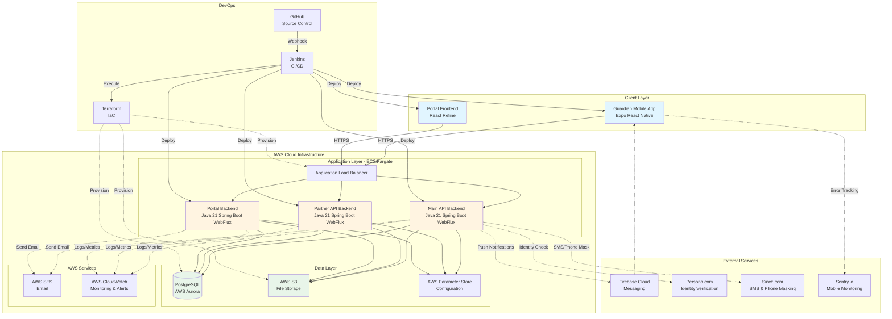

# G2 Sentry System - Technical Overview

## Executive Summary

G2 Sentry is a cloud-native platform that provides **On-Demand Physical Sentry services by Trusted Professionals**. The system connects clients requiring security presence with verified security professionals (Guardians) through a fully automated, scalable infrastructure built on modern technologies and best practices.

## System Architecture

The platform follows a microservices architecture deployed entirely on AWS, emphasizing scalability, reliability, and operational excellence through automation and cloud-native principles.

### Core Components

#### Backend Services

**Main API Backend**
- Built on Java 21 (LTS) with Spring Boot 3.x
- Utilizes reactive WebFlux for fully asynchronous operations
- Processes requests from Guardian mobile applications
- Handles callback communications to partners
- Deployed on AWS ECS/Fargate serverless compute
- Automatically scales based on demand via Application Load Balancer

**Partner API Backend**
- Shares identical technology stack with Main API
- Manages partner-specific operations and integrations
- Co-located on AWS ECS/Fargate with independent scaling

**Portal Backend**
- Manages billing operations and user administration
- Built on the same Java 21/Spring Boot 3.x reactive stack
- Serves both internal G2 Sentry staff and external partners
- Provides incident management and troubleshooting capabilities

#### Frontend Applications

**Guardian Mobile App**
- Cross-platform solution using Expo React Native framework
- Compatible with modern Android and iOS devices
- Communicates directly with Main API backend
- Real-time push notifications via Firebase Cloud Messaging

**Portal Frontend**
- Built using React Refine framework (subject to evolution)
- Serves dual purposes:
  - Internal dashboard for G2 Sentry operations team
  - Partner portal for billing management and analytics
- Features include statistics visualization, incident management, and support communication

#### Data Layer

**PostgreSQL Database**
- Managed through AWS Aurora SaaS
- Centralized data store for all system entities
- High availability and automated backups

**AWS S3 Storage**
- Stores large files (avatars, documents)
- Utilizes presigned URLs for secure, temporary access

### Cloud-Native Design Principles

All backend services adhere to the [12-Factor App](https://12factor.net/) methodology:
- **Stateless architecture** enabling horizontal scaling
- **Externalized configuration** via AWS Parameter Store
- **Disposable processes** for rapid deployment and scaling
- **Environment parity** across development, staging, and production

### Third-Party Integrations

**Identity Verification**
- [Persona](https://withpersona.com/) for Guardian identity verification and KYC compliance

**Communication Services**
- **Firebase Cloud Messaging**: Push notifications to Guardian devices
- **AWS SES**: Transactional email delivery
- **Sinch.com**: Phone number masking during job sessions and OTP SMS delivery

**Monitoring & Observability**
- **AWS CloudWatch**: Backend system monitoring, logging, and alerting
- **Sentry.io**: Mobile application error tracking and performance monitoring

### DevOps & Infrastructure

**CI/CD Pipeline**
- **Jenkins**: Automated build, test, and deployment orchestration
- **GitHub**: Source code management and version control
- Fully automated deployment pipeline for all components

**Infrastructure as Code**
- **Terraform**: Complete AWS infrastructure management
- Jenkins-orchestrated infrastructure deployments
- Version-controlled infrastructure definitions ensuring reproducibility

## System Architecture Diagram

## Technology Stack Summary

| Layer | Technology | Purpose |
|-------|-----------|---------|
| **Backend Runtime** | Java 21 (LTS) | Long-term support, modern language features |
| **Backend Framework** | Spring Boot 3.x WebFlux | Reactive, non-blocking asynchronous processing |
| **Mobile Framework** | Expo React Native | Cross-platform mobile development |
| **Web Framework** | React Refine | Admin panel and portal development |
| **Database** | PostgreSQL (AWS Aurora) | Relational data storage with high availability |
| **Compute** | AWS ECS/Fargate | Serverless container orchestration |
| **Load Balancing** | AWS Application Load Balancer | Traffic distribution and SSL termination |
| **Object Storage** | AWS S3 | Scalable file storage with presigned URLs |
| **Configuration** | AWS Parameter Store | Externalized, encrypted configuration management |
| **Email** | AWS SES | Transactional email delivery |
| **Push Notifications** | Firebase Cloud Messaging | Mobile push notification delivery |
| **SMS/Voice** | Sinch.com | OTP delivery and phone number masking |
| **Identity Verification** | Persona | KYC and identity verification |
| **Backend Monitoring** | AWS CloudWatch | Logs, metrics, and alerting |
| **Mobile Monitoring** | Sentry.io | Error tracking and performance monitoring |
| **CI/CD** | Jenkins + GitHub | Automated build and deployment |
| **IaC** | Terraform | Infrastructure provisioning and management |

## Key Architectural Benefits

### Scalability
- Serverless compute automatically adjusts to demand
- Stateless design enables infinite horizontal scaling
- Reactive programming model maximizes resource efficiency

### Reliability
- Multi-AZ database deployment for high availability
- Auto-scaling prevents resource exhaustion
- Comprehensive monitoring detects issues proactively

### Maintainability
- Infrastructure as Code ensures reproducible environments
- 12-Factor methodology simplifies operational complexity
- Automated CI/CD reduces deployment risk

### Security
- Externalized configuration keeps secrets out of code
- Presigned URLs provide time-limited, secure file access
- Phone number masking protects user privacy
- Third-party identity verification ensures Guardian trust

---

*This technical overview represents the current architecture of the G2 Sentry platform. Components marked as "subject to change" may evolve as the platform matures.*