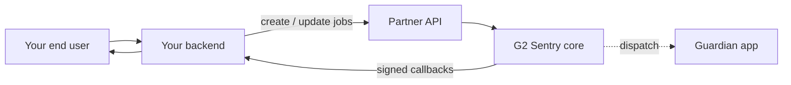

# Tech Overview

A one-pager on what sits behind the Partner API, so you know what to
expect from it and where failures can come from.

## What G2 Sentry does

Connects requesters (partners and end users) with verified security
professionals (Guardians) for on-demand physical security work — open
houses, event duty, overnight watch, etc. The platform handles
onboarding, identity verification, dispatch, live tracking, and
post-job feedback.

## What you talk to

As a partner, you only touch two surfaces:

- **Partner API** — a REST service for job CRUD plus login/refresh.
- **Callback webhooks** — HMAC-signed POSTs delivered to a URL on your
  server when a job changes state.

Everything else (Guardian app, dispatch logic, identity checks, SMS
masking, the portal) is internal to G2 Sentry and not part of your
integration.

## Data flow

```mermaid
flowchart LR
    Client[Your end user]
    You[Your backend]
    PAPI[Partner API]
    Core[G2 Sentry core]
    Guardian[Guardian app]

    Client --> You
    You -->|create / update jobs| PAPI
    PAPI --> Core
    Core -.->|dispatch| Guardian
    Core -->|signed callbacks| You
    You --> Client
```

Solid arrows are request/response; dashed is asynchronous. Nothing you
send to the Partner API reaches a Guardian directly — G2 Sentry's
dispatch picks the Guardian and routes the job.

## What's guaranteed and what's not

| Property | Behaviour |
|---|---|
| **API availability** | 99.9% target on the production environment. Demo is best-effort. |
| **Token lifetime** | Access tokens 15 min, refresh tokens 7 days. |
| **Callback delivery** | At-least-once with exponential backoff. Your handler must be idempotent. |
| **Callback ordering** | Not guaranteed. Always treat `jobStatus` on the payload as the source of truth, not the sequence of events. |
| **Cut-off window** | A partner can cancel a job up to 2h before its scheduled start. A Guardian can withdraw up to 2h before start. Past that, state transitions go through G2 Sentry operations. |
| **Rate limits** | 60 requests / minute per partner key. Contact us if you need more. |

## What we run (for context, not action)

Nothing on this list is part of the contract you integrate against —
it's background so you know what's responding to your requests.

| Layer | Tech |
|---|---|
| Partner API | Java 21 + Spring Boot WebFlux (reactive, non-blocking) |
| Database | PostgreSQL on AWS Aurora |
| Compute | AWS ECS/Fargate behind an Application Load Balancer |
| Secrets / config | AWS Parameter Store |
| Push to Guardian app | Firebase Cloud Messaging |
| SMS + masked phone numbers | Sinch |
| Identity verification | Persona |
| Monitoring | AWS CloudWatch (backend), Sentry (mobile) |

## Where bugs usually come from

If something isn't working end-to-end, 90% of the time it's one of:

1. **Callback URL not reachable from the public internet** — we can't
   deliver webhooks to `localhost` or an internal-only hostname. Use
   an ngrok-style tunnel during development.
2. **Signature mismatch** — you're computing HMAC over the parsed JSON
   instead of the raw request body, or using the wrong secret. See
   [Callbacks](../partner-api/callbacks.md).
3. **Expired access token** — it's been 15 minutes and you haven't
   refreshed. 401 responses are your signal to refresh.
4. **Past the cut-off** — you're trying to cancel less than 2h before
   the scheduled start. Responses say so explicitly.

If you've ruled those out, email
[mikeg@g2sentry.com](mailto:mikeg@g2sentry.com) with your `jobId` and
we'll look at the logs.
