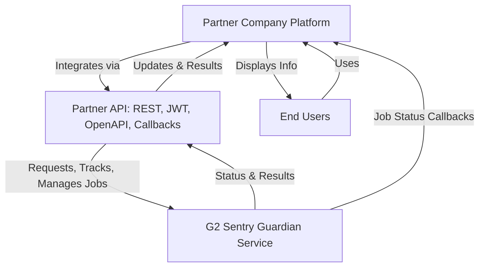

# Partner API Overview

G2 Sentry, Inc. provides the Partner API to enable seamless integration of your products with our guardian service. Through the Partner API, companies can offer their users the ability to request guardian services, monitor job status, manage ongoing jobs, and review completed tasks—all from within their own platforms.

A fundamental feature of the Partner API, in addition to the OpenAPI specification, is its support for callbacks. These callbacks allow G2 Sentry to send real-time job status updates directly to your platform, ensuring your users and systems are always informed about the progress and completion of their requests.

The API is designed with modern standards in mind, including OpenAPI specifications, JWT authentication, and RESTful endpoints. This ensures that integration is straightforward and compatible with nearly any contemporary technology stack.

Whether you are looking to automate workflows, enhance your product offerings, or provide additional value to your users, the Partner API makes it easy to connect with G2 Sentry’s guardian service. Our team is committed to supporting your integration and helping you get the most out of our platform.

Explore the documentation to get started with authentication, endpoints, usage examples, and implementing callbacks for job status updates.

## High-Level Architecture

