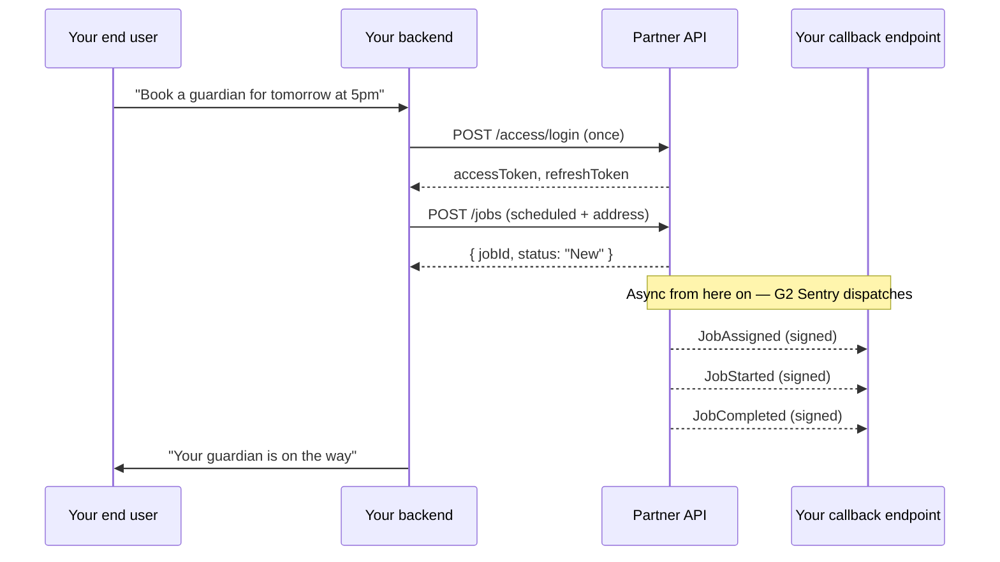

# Partner API Overview

The Partner API is a small REST surface that lets your backend book,
track, cancel, and rate on-demand Guardian jobs on behalf of your
end users. It's OpenAPI-described, JWT-authenticated, and paired with
signed webhook callbacks so you don't have to poll.

## Mental model

Three actors, two channels:

```mermaid
sequenceDiagram
    participant Client as Your end user
    participant You as Your backend
    participant API as Partner API
    participant Hooks as Your callback endpoint

    Client->>You: "Book a guardian for tomorrow at 5pm"
    You->>API: POST /access/login (once)
    API-->>You: accessToken, refreshToken
    You->>API: POST /jobs (scheduled + address)
    API-->>You: { jobId, status: "New" }
    note over API,Hooks: Async from here on — G2 Sentry dispatches
    API-->>Hooks: JobAssigned (signed)
    API-->>Hooks: JobStarted (signed)
    API-->>Hooks: JobCompleted (signed)
    You->>Client: "Your guardian is on the way"
```

Two things to notice:

1. **Callbacks do the heavy lifting.** Polling `/jobs/{id}/status` is
   available for backfill and UI refreshes, but you should drive your
   UX off the signed webhooks.
2. **Scope.** You can only see jobs your partner created. Cross-partner
   access is not a thing.

## What you get

- **JWT auth.** Exchange partner key + secret for a 15-minute access
  token. Refresh tokens last 7 days.
- **Job CRUD.** Create, read, patch, cancel, review.
- **Real-time signed webhooks.** HMAC-SHA256 over the raw body, sent
  via `X-Signature`. See [Callbacks](./callbacks.md).
- **OpenAPI spec.** Browse and test endpoints interactively in the
  demo Swagger UI (link below).

## Try it now

- **Swagger UI (demo)** — [https://partner-api-demo.g2sentry.com/swagger-ui.html](https://partner-api-demo.g2sentry.com/swagger-ui.html)
- **Postman collection** — [download](./G2SentryPartnerAPI.postman_collection.json)
- **Sample app** — [the CodeSandbox test app](../cookbook/codesandbox-test-app.md)

## Next

- [Workflow](./workflow.md) — the states a job moves through, and
  which events trigger each callback.
- [API reference](./API.md) — every endpoint, with copy-pasteable
  `curl` examples.
- [Callbacks](./callbacks.md) — payload shapes and HMAC verification
  recipes in Node and Python.
