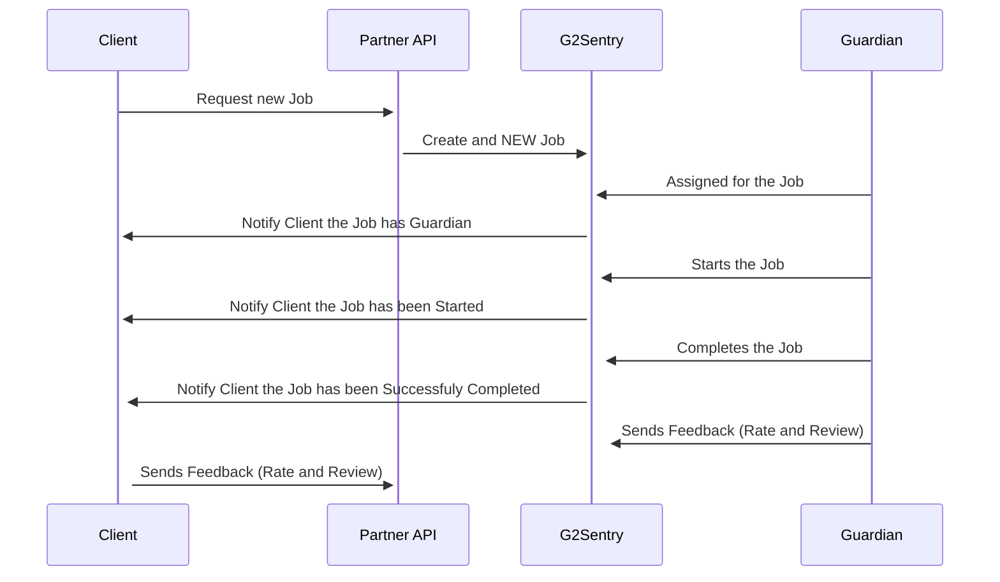

# G2Sentry Workflow Overview
## Purpose
This document provides a high-level overview of the G2Sentry workflow, describing the lifecycle of a Guardian Service job and the interactions between the partner, guardian, and partner client.

## Workflow Summary
1. **Job Request**
    - The partner requests a new Guardian Service job.
2. **Job Assignment**
    - A guardian is notified and can accept the job.
3. **Job Execution**
    - When the scheduled time arrives, the guardian travels to the job location and starts the job.
    - The guardian completes the job when the allotted time ends.
4. **Feedback**
    - After job completion, both the partner client and the guardian can submit feedback (rating 1-5 and a review) about the job and each other.
5. **Job Withdrawal/Cancellation**
    - The guardian may withdraw from an assigned job up to 2 hours before the scheduled start time (cut-off time).
    - The partner client may cancel the job up to 2 hours before the scheduled start time.
6. **Notifications**
    - The partner is notified of job events via callbacks to the partner's API.
## Roles
- **Partner**: Requests jobs and receives event notifications.
- **Guardian**: Accepts, performs, or withdraws from jobs; provides feedback.
- **Partner Client**: Cancels jobs, provides feedback.
## Key Events
- Job Requested
- Job Assigned
- Guardian Withdrawn (before cut-off)
- Job Cancelled (before cut-off)
- Job Started
- Job Completed
- Feedback Submitted
- Partner Notified (via API callback)
## Diagram

