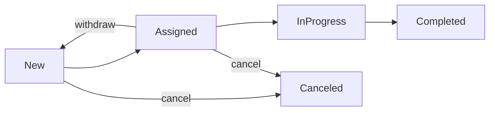
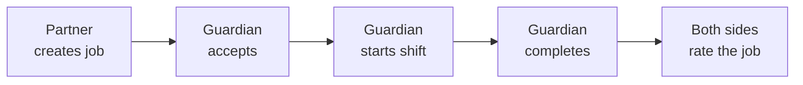

# Job Workflow

A job moves through a small set of states from the moment you create
it until a guardian closes it out. This page is the definitive
reference for those states, what causes each transition, and which
events reach your callback URL.

## Job states

Four states on the happy path, plus `Canceled` (note: single L — that's
how the API spells it) as a possible exit from the first two:

```mermaid
flowchart LR
    New --> Assigned --> InProgress --> Completed
    New -->|cancel| Canceled
    Assigned -->|cancel| Canceled
    Assigned -->|withdraw| New
```

| State | Meaning |
|---|---|
| **New** | Job created; waiting for a Guardian to accept. |
| **Assigned** | A Guardian has accepted and is scheduled. |
| **InProgress** | The Guardian has arrived and started the shift. |
| **Completed** | The Guardian closed the shift. Feedback can now be submitted. |
| **Canceled** | Either the partner canceled, or no Guardian accepted before it became impossible to fulfil. |

## Cut-off rules

Both sides have a **2-hour cut-off** before the scheduled start time:

- Before cut-off — the partner can cancel, and an assigned Guardian
  can withdraw, both at will. Withdrawal returns the job to `New`;
  cancelation moves it to `Canceled`.
- After cut-off — neither side can exit via the API. Late changes go
  through G2 Sentry operations; email
  [mikeg@g2sentry.com](mailto:mikeg@g2sentry.com).

## End-to-end happy path

Five steps from booking to feedback. The callback you receive is
listed under each step where one fires.

```mermaid
flowchart LR
    A[Partner<br/>creates job]
    B[Guardian<br/>accepts]
    C[Guardian<br/>starts shift]
    D[Guardian<br/>completes]
    E[Both sides<br/>rate the job]
    A --> B --> C --> D --> E
```

| Step | Who drives it | Callback fired |
|---|---|---|
| 1. Create job | Partner (`POST /jobs`) | — |
| 2. Accept | Guardian, in their app | `JobAssigned` |
| 3. Start shift | Guardian, on arrival | `JobStarted` |
| 4. Complete shift | Guardian, at end | `JobCompleted` |
| 5. Rate | Partner (`POST /jobs/{id}/review`) + Guardian in-app | — |

## Events vs callbacks

G2 Sentry logs many events internally, but only four of them are
pushed to your callback URL:

| Event | Delivered as callback? | Trigger |
|---|---|---|
| `NewJob` | No (internal) | Partner creates the job. |
| `JobAssigned` | **Yes** | Guardian accepts the offer. |
| `JobStarted` | **Yes** | Guardian marks arrival and starts the shift. |
| `JobCompleted` | **Yes** | Guardian finishes the shift. |
| `JobWithdrawed` | **Yes** | Guardian withdraws before cut-off. Job returns to `New`. |
| `JobGuardianRate` | No (internal) | Guardian rates the client. |
| `JobClientRate` | No (internal) | Partner submits client feedback. |

Poll `/jobs/{id}/status` if you need any event that's not in the
callback stream.

## Feedback

After a job moves to `Completed`, both sides can submit feedback
once. Ratings are 1–5 with an optional comment:

- **Partner-side** (acting for the end user): `POST /jobs/{id}/review`
- **Guardian-side** is submitted from the Guardian app directly to
  G2 Sentry. You don't need to handle it.

## Next

- Full callback payload shapes and verification snippets:
  [Callbacks](./callbacks.md).
- Endpoint reference with curl examples: [API](./API.md).
